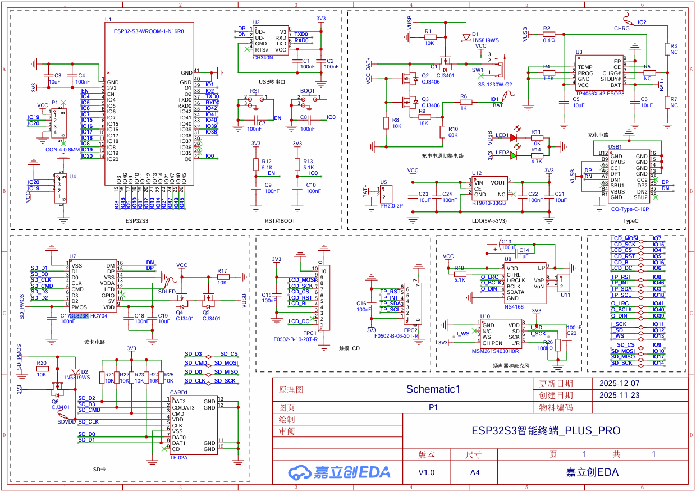
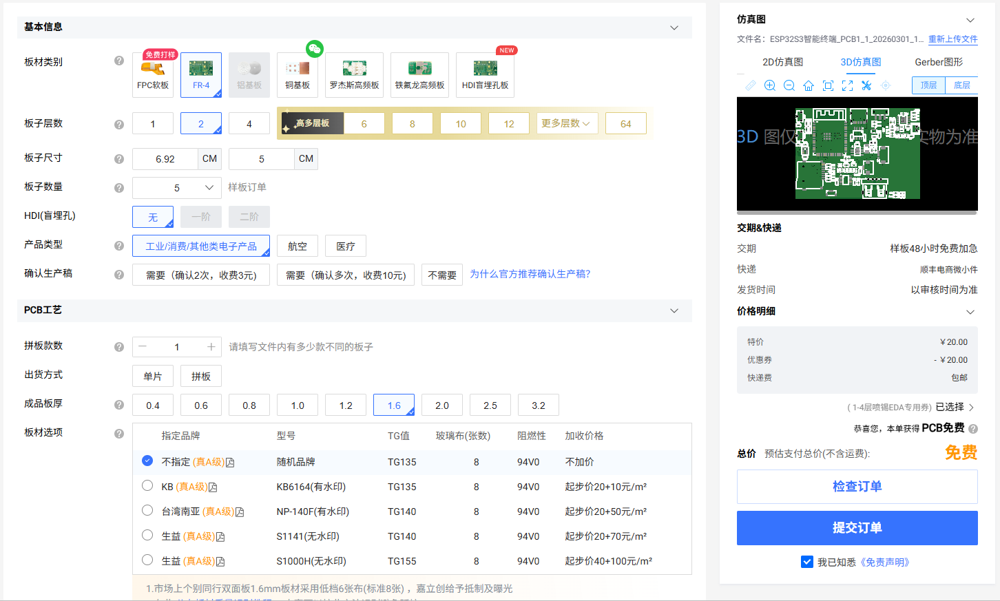
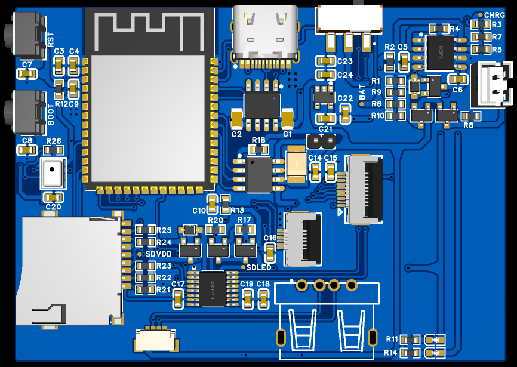
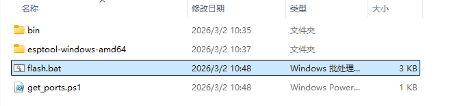
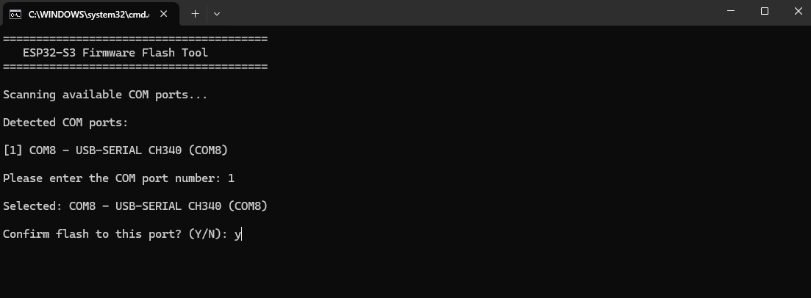
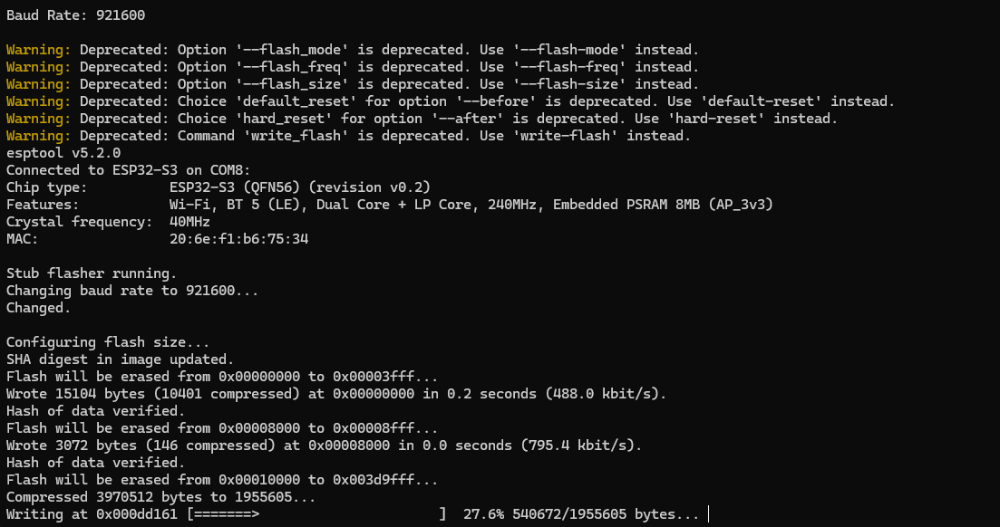

# esp32s3-lvgl-terminal

基于 ESP32-S3 的 LVGL 多功能智能终端，集成Wi-Fi和亮度设置、串口终端、时间和天气显示、音乐播放、小智AI语音对话、小游戏等功能。

****

**⭐ 欢迎提出Issues和PR，如果这个项目对你有帮助，请给个 Star！**

## 📑 目录 

- [📖 项目简介](#-项目简介)
- [📁 项目结构](#-项目结构)
- [🛠️ 硬件配置](#️-硬件配置)
  - [1. 物料清单](#1-物料清单)
  - [2. 引脚映射](#2-引脚映射)
  - [3. 打板焊接](#3-打板焊接)
- [🔧 软件配置](#-软件配置)
  - [1. 安装 VSCode](#1-安装-vscode)
  - [2. 安装插件](#2-安装插件)
  - [3. 编译烧录](#3-编译烧录)
  - [4. 免环境烧录](#4-免环境烧录)
- [⚠️ 注意事项](#️-注意事项)
- [📧 联系方式](#-联系方式)

## 📖 项目简介

这是一个基于 **ESP32-S3** 和 **LVGL** 图形库开发的多功能智能终端项目。通过友好的触摸屏界面，提供丰富的交互功能和便捷的设备管理，项目采用 FreeRTOS 多任务架构，支持高效的并发处理。

**主要功能：**

- ✅ **主界面**：实时显示时间、滚动文字、APP入口等信息
- ✅ **设置**：支持屏幕亮度调节、Wi-Fi 扫描与连接配置
- ✅ **串口**：实时串口数据收发功能
- ✅ **天气**：显示实况天气和未来三天天气预报（心知天气 API）
- ✅ **音乐**：播放 SD 卡内的 MP3 音乐，支持音量调节
- ✅ **小智**：AI 语音对话（百度语音识别 + MiniMax AI 聊天模型）
- ✅ **游戏**：集成开源 LVGL 小游戏（2048、植物大战僵尸、消消乐、羊了个羊）
- ✅ **日历**：日历信息查看
- ✅ **电源管理**：使用 5V USB 或 4.2V 锂电池供电，接上锂电池时插入USB可边充边放
- ✅ **板载读卡**：支持关闭开关时插入USB连接电脑读取SD卡

**视频演示：**

- [LVGL+Freertos开发基于ESP32S3的智能终端系统，源码已上传_哔哩哔哩_bilibili](https://www.bilibili.com/video/BV1xu4m1c74M/?spm_id_from=333.1387.upload.video_card.click&vd_source=b2115ccf4e995ec04004dc3600b1cecb)
- [LVGL基于ESP32S3的智能终端PLUS_哔哩哔哩_bilibili](https://www.bilibili.com/video/BV1eXSuBkEo8/?spm_id_from=333.1387.upload.video_card.click&vd_source=b2115ccf4e995ec04004dc3600b1cecb)

## 📁 项目结构

```
esp32s3-lvgl-terminal/
├── src/                        # 源代码目录
│   ├── main.cpp                # 主程序入口，初始化与任务创建
│   ├── config.cpp/.h           # 配置管理模块
│   ├── data.cpp/.h             # 数据处理模块
│   ├── task.cpp/.h             # FreeRTOS 任务管理
│   ├── wifiuser.cpp/.h         # Wi-Fi 扫描、连接与状态管理
│   ├── music.cpp/.h            # SD卡MP3音乐播放控制
│   ├── sduser.cpp/.h           # SD卡初始化与文件操作
│   ├── xiaozhi.cpp/.h          # AI语音对话与识别模块
│   └── ui/                     # LVGL UI 组件
│       ├── ui.h                # UI 头文件
│       └── src/                # UI 源代码
│           ├── screens/        # 各页面界面
│           ├── components/     # UI 组件
│           ├── images/         # 图片资源
│           ├── fonts/          # 字体资源
│           └── ui.cpp          # UI 主文件
├── SquareLine_Project/         # SquareLine Studio 项目文件
│   ├── SquareLine_Project.spj  # 项目配置文件
│   ├── assets/                 # 设计资源
│   ├── backup/                 # 备份文件
│   └── cache/                  # 缓存文件
├── hardware/                   # 硬件设计文件
│   ├── SCH_Schematic_*.pdf     # 原理图PDF
│   ├── Gerber_PCB_*.zip        # PCB Gerber文件
│   └── BOM_PCB_*.xlsx          # BOM采购清单
├── include/                    # 头文件目录
├── lib/                        # 外部库目录
├── platformio.ini              # PlatformIO配置文件
├── default_16MB.csv            # 分区表配置
├── images
├── README.md 
└── LICENSE 
```

## 🛠️ 硬件配置

### 1. 物料清单

- **主控芯片**：【ESP32-S3 N16R8】16MB Flash + 8MB PSRAM
- **显示屏**：【ST7789】3.5寸 SPI TFT 320x240
- **触摸屏**：【CST816S】I2C 电容触摸
- **音频输出**：【NS4168】I2S DAC 功放模块
- **麦克风**：【MSM261S4030H0R】I2S MEMS 数字麦克风
- **存储卡**：【闪迪】Micro SD卡
- **USB读卡**：【GL823K】读卡器
- **USB转串口**：【CH340N】USB转TTL
- **电源管理**：【TPS4056】单节锂电池充电、【RT9013】LDO稳压
- **供电**：【5V USB】供电 或 【4.2V 锂电池】供电

### 2. 引脚映射

| 功能模块 | 引脚定义 |
|---------|:--------|
| **SPI TFT 显示屏** | SCK=15, CS=4, MOSI=7, DC=6, BLK=16, RST=5 |
| **I2C 触摸屏** | SDA=3, SCL=18, RST=8, IRQ=46 |
| **I2S 音频输出** | BCLK=40, LRC=41, DOUT=39 |
| **I2S 麦克风** | SCK=11, WS=13, SD=12 |
| **SPI SD 卡** | CS=9, SCK=14, MISO=17, MOSI=10 |



### 3. 打板焊接

**PCB 打板：**

- 板子尺寸69.2x50mm，可在 **嘉立创** 领取1~4层专用券免费打板

- 上传 `hardware/` 目录中的 Gerber 文件

- 选择参数：层数2层、板子数量5、板厚1.6mm

  

**元器件采购与焊接：**

- 参考 `hardware/` 目录中的 BOM 表

- BOM 表包含元器件型号、数量和购买链接

- 板上元器件都标注了位号，根据 BOM 表焊接

- BOM 表中未标注的位号不需要焊接

  

## 🔧 软件配置

### 1. 安装 VSCode

**下载**：访问 [VSCode 官网](https://code.visualstudio.com/)，点击 "Download for Windows" 下载安装包。

**安装**：运行下载的安装程序，按照提示完成安装。建议勾选 "Add to PATH" 选项。 

### 2. 安装插件

**中文语言包 (Chinese Language Pack)**：

*   点击左侧扩展图标，搜索 `Chinese`。
*   选择 **Chinese (Simplified) (简体中文) Language Pack**，点击 **Install**。
*   安装完成后重启 VSCode 即可生效。

**C/C++ 扩展**：

*   点击左侧扩展图标，搜索 `C/C++`。
*   选择由 **Microsoft** 发布的插件，点击 **Install**。
*   该插件提供代码高亮、智能提示等功能，是开发 C/C++ 项目的基础。

**Serial Monitor 扩展**：

*   点击左侧扩展图标，搜索 `Serial Monitor`。
*   选择由 **Microsoft** 发布的插件，点击 **Install**。
*   该插件提供串口监视器，可以实时查看开发板的输出信息。

**PlatformIO 扩展**：

- 点击左侧扩展图标，搜索 `PlatformIO`。


- 选择由 **PlatformIO** 发布的插件（通常是第一个，带有蚂蚁图标），点击 **Install**。


- VS Code 右下角会提示 "Installing PlatformIO Core..."，**打开魔法耐心等待**。

- 安装完成后，通常会提示重启 VS Code，请点击 "Reload Now" 或手动重启。

### 3. 编译烧录

**克隆项目**：

```powershell
# 任选其一
git clone https://github.com/CaddonThaw/esp32s3-lvgl-terminal.git
git clone https://github.com/Lee-Stone/esp32s3-lvgl-terminal.git
git clone https://github.com/Cyberangel55321/esp32s3-lvgl-terminal.git
```

**打开项目**：

*   在 VS Code 中，点击菜单栏 `File` -> `Open Folder...`。
*   选择克隆的 `esp32s3-lvgl-terminal` 目录（例如 `f:\github\esp32s3-lvgl-terminal\`）。

**等待初始化**：

* 首次打开 PlatformIO 项目时，它会自动下载项目所需的开发框架（如 `framework-arduinoespressif32`）和依赖库，**打开魔法耐心等待**。

* 若在**开魔法**的情况下下载仍然很慢，则打开本地**C:\Users\用户名\\.platformio\penv\\pip.conf**，替换为以下内容（换成国内源，保存后重启VSCode）：

  ```
  [global]
  user = no
  index-url = https://mirrors.aliyun.com/pypi/simple/
  
  [install]
  trusted-host = mirrors.aliyun.com
  ```

**配置说明**：

- 百度语音 API：在 `.pio\libdeps\esp32-s3-devkitc-1\baidu-xiaozhi\xiaozhi_ai.h` 中填入 `BAIDU_APP_ID` 、`BAIDU_APP_KEY` 和 `BAIDU_SECRET_KEY`。

  [百度语音 API申请](https://blog.csdn.net/vor234/article/details/136975580)

- MiniMax API：在 `.pio\libdeps\esp32-s3-devkitc-1\baidu-xiaozhi\xiaozhi_minimax.h` 中填入 `MiniMaxKey`。

  [MiniMax API申请](https://vor2345.blog.csdn.net/article/details/136768206)

- 心知天气 API：在 `src\data.cpp` 中填入 `Weather_Key`。

  [心知天气 API申请](https://www.seniverse.com/)

**编译项目**：

*   点击 VS Code 底部状态栏左侧的 **对号图标 (Build)** `✓`。
*   或者使用快捷键 `Ctrl+Alt+B`。
*   如果终端输出 `SUCCESS`，说明环境配置无误且代码编译成功。

**烧录程序**：

*   点击底部状态栏的 **右箭头图标 (Upload)** `→`。
*   按下开发板的BOOT按键，再按下RST按键松开，最后松开BOOT按键进入下载模式。
*   PlatformIO 会自动寻找串口并烧录程序。

### 4. 免环境烧录

**下载烧录工具**：[flash.zip](https://github.com/Lee-Stone/esp32s3-lvgl-terminal/releases/latest/download/flash.zip)

**烧录程序**：

- 解压**烧录工具**，双击文件夹下的 **flash.bat** 文件（若提示有风险，右击以**管理员身份运行**）。

  

- 按下开发板的BOOT按键，再按下RST按键松开，最后松开BOOT按键进入下载模式。

- 选择开发板的串口序号，输入 **y** 确定后开始烧录。

  

  

- 烧录完成之后提示 **Flash Successful**。

  

**提示**：烧录工具中包含工程编译出来的 **bin** 文件。

## ⚠️ 注意事项

- **首次使用需配置 API 密钥**：百度语音、MiniMax AI 和心知天气的 API 需要自行申请并填入相应配置文件中，否则相关功能无法使用。

- **SquareLine Studio 工程**：需要下载 [SquareLin Studio V1.5.0](https://static.squareline.io/downloads/SquareLine_Studio_Windows_v1_5_0.zip) 打开。

- **烧录模式进入**：ESP32-S3 需要手动进入下载模式（按住 BOOT 键，按下 RST 键松开，再松开 BOOT 键），部分开发板支持自动下载。

- **SD 卡格式要求**：SD 卡推荐使用闪迪，大小无要求，需格式化为 FAT32 文件系统，MP3 文件需放置在根目录才能被识别。

- **魔法网络环境**：首次编译需要下载大量依赖库和工具链，建议开启魔法以加快下载速度。如遇下载慢，可配置国内 pip 源。

- **电源供电**：建议使用 5V/2A 以上的电源适配器或质量可靠的 USB 数据线，避免因供电不足导致系统不稳定。

- **串口波特率**：串口通信波特率默认为 115200，使用串口监视器时需保持一致。

## 📧 联系方式

- 🐧：2103539430
- 🛰：Ubuntu_Noble

